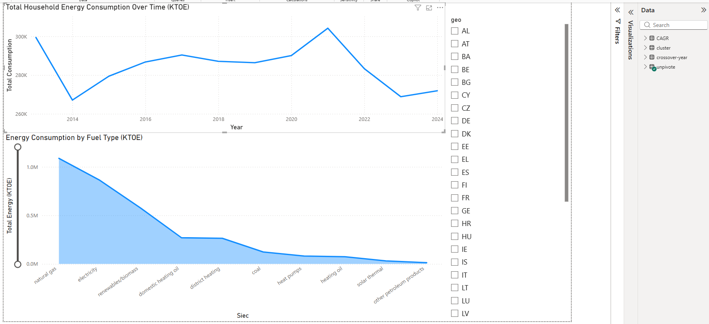
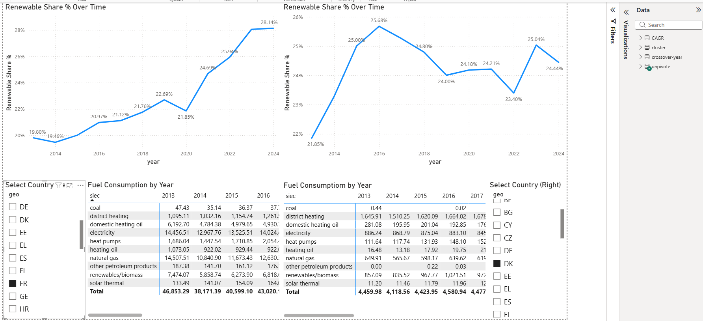
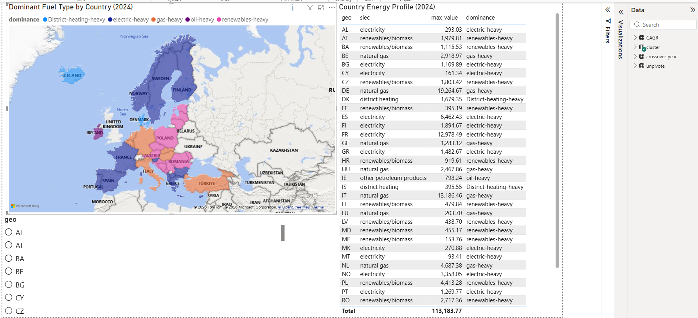
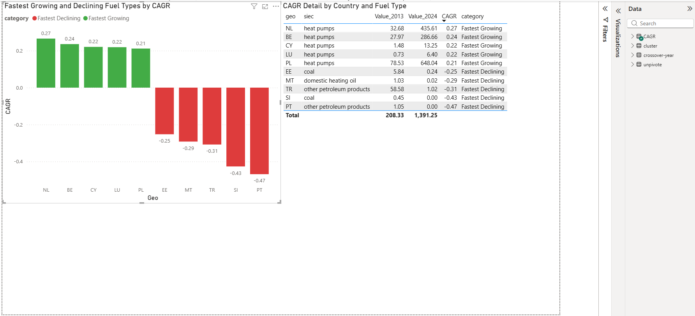
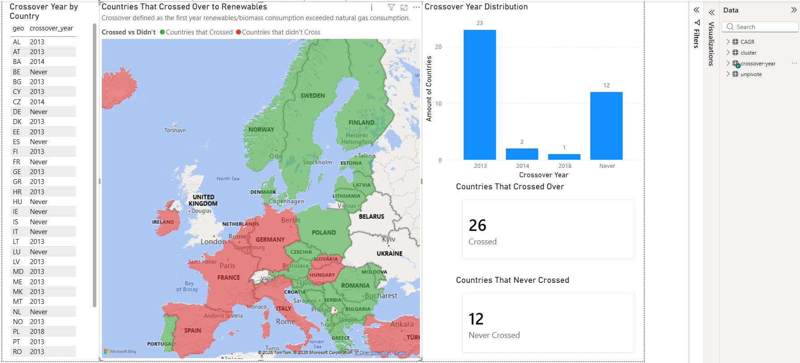

# European Household Energy Transition (2013–2024) — Power BI Dashboard

## Overview

This project visualizes and analyzes household energy consumption across European countries from 2013 to 2024 using Power BI Desktop.
The goal is to track the shift toward renewable energy, identify dominant fuel types by country, and surface meaningful patterns through interactive dashboards, DAX measures, and multi-page report design.

The dashboard covers:
- Total household energy consumption trends across Europe (2013–2024)
- Renewable vs non-renewable consumption breakdown by country
- Renewable energy share progression over time with side-by-side country comparison
- Dominant fuel type per country based on 2024 consumption data
- Fastest growing and declining fuel types by Compound Annual Growth Rate (CAGR)
- Crossover analysis — when renewables/biomass first exceeded natural gas per country

---

## Dashboard Preview

### Total Energy Consumption


### Renewable vs Non-Renewable


### Country Comparison


### Energy Profile by Country


### CAGR Analysis


### Renewables Crossover


---

## Objectives

This project aims to:
- Design a multi-page Power BI report with a clear analytical narrative around Europe's energy transition
- Apply DAX to create calculated measures beyond raw column aggregations
- Use Power Query to handle data quality issues (SIEC code replacement, null handling, classification columns)
- Visualize geographic energy patterns using filled map visuals
- Implement independent side-by-side country comparison using Edit Interactions
- Practice report layout, visual selection, and interactivity design

---

## Pages & What They Show

| Page | Description |
|------|-------------|
| Total Energy Consumption | Time-series line chart of total consumption 2013–2024 and ranked area chart by fuel type, filterable by country |
| Renewable vs Non-Renewable | Treemap of fuel type share of total consumption and horizontal bar chart comparing renewable vs non-renewable by country, filterable by year and country |
| Country Comparison | Side-by-side independent country comparison with renewable share % line charts and fuel consumption breakdown tables, each driven by its own slicer |
| Energy Profile by Country | Filled map colored by dominant fuel type in 2024 (gas-heavy, electric-heavy, renewables-heavy, etc.) with supporting cluster detail table |
| CAGR Analysis | Bar chart of the top 5 fastest growing and top 5 fastest declining fuel-country combinations by CAGR (2013–2024), color coded green and red, with detail table |
| Renewables Crossover | Map showing countries that crossed over vs never crossed, KPI cards (26 crossed, 12 never crossed), crossover year distribution chart, and country-level table |

---

## Business Questions Explored

- Which fuel types dominate European household energy consumption?
- How has the renewable energy share evolved across Europe from 2013 to 2024?
- Which countries lead and which lag in the transition away from fossil fuels?
- What is the dominant fuel type for each country in 2024?
- Which fuel types are growing fastest — and which are declining fastest?
- How many European countries have crossed over from natural gas to renewables/biomass — and when?

---

## Power BI Concepts Used

- Filled Map and Azure Map visuals
- Treemap, Line Chart, Area Chart, Bar Chart, and Matrix visuals
- KPI card visuals
- Slicers (list, dropdown, and input types)
- Edit Interactions for independent side-by-side visual filtering
- Cross-filtering between visuals
- DAX calculated measures
- Power Query custom columns and value replacement
- Conditional formatting via Legend fields

---

## DAX Measures

```dax
Renewable Share % =
DIVIDE(
    CALCULATE(SUM('unpivote'[value]), 'unpivote'[Renewables] = "Renewable"),
    CALCULATE(SUM('unpivote'[value]), 'unpivote'[siec] = "Total")
)
```

`DIVIDE` is used instead of `/` to handle division by zero gracefully.
The Total row from the Eurostat dataset is used as the denominator rather than summing individual fuel types, ensuring accuracy even when individual rows contain nulls.

---

## Power Query

A custom classification column was added to categorize each fuel type:

```
Renewables =
if [siec] = "renewables/biomass" or [siec] = "heat pumps" or [siec] = "solar thermal"
then "Renewable"
else if [siec] = "Total" then null
else "Non-Renewable"
```

Null is assigned to Total rows to prevent them from being counted as Non-Renewable and distorting the renewable share ratio.

SIEC energy product codes were also replaced with readable names in Power Query:

```
G3000  → natural gas
E7000  → electricity
RA600  → heat pumps
RA410  → solar thermal
H8000  → district heating
...
```

---

## Key Findings

- **Natural gas and electricity** account for over 55% of total European household energy consumption across the full period
- **26 out of 38 countries** had already crossed over to renewables/biomass exceeding natural gas by 2013, reflecting longstanding biomass traditions in Eastern and Northern Europe
- **Heat pumps** showed the fastest growth rates of any fuel type, with CAGRs reaching 0.27 in the Netherlands and 0.24 in Belgium
- **Coal and other petroleum products** recorded the steepest declines, with Portugal and Slovenia showing CAGRs of -0.47 and -0.43 respectively
- **Renewable share** across all countries grew from approximately 19.5% in 2013 to 28% by 2024, with a notable dip around 2016–2018
- **Germany, France, and Italy** are the largest consumers in absolute terms, but smaller countries like Austria and Latvia lead in renewables share
- **Ireland** stands out as the only Western European country classified as oil-heavy in 2024, driven by high reliance on other petroleum products rather than natural gas

---

## Dataset

- **Source:** [Eurostat — Household Energy Consumption](https://ec.europa.eu/eurostat)
- **File:** `hh_energy_fuel.csv`
- **Rows:** 451 (wide format) / ~5,400 (unpivoted long format)
- **Period:** 2013–2024
- **Countries:** 38 European countries
- **Fuel types:** 10 (natural gas, electricity, renewables/biomass, coal, heat pumps, solar thermal, district heating, heating oil, domestic heating oil, other petroleum products)
- **Unit:** Kilotonnes of Oil Equivalent (KTOE)

---

## Project Structure

```text
eurostat-household-energy-PowerBi/
│
├── README.md
├── dataset/
│   └── hh_energy_fuel.csv
├── exports/
│   ├── unpivote.csv
│   ├── cluster.csv
│   ├── crossover_year.csv
│   └── CAGR.csv
├── dashboard/
│   └── eu_household_energy.pbix
└── screenshots/
    ├── 01_Total_Energy_Consumption.png
    ├── 02_Renewable_vs_Non-Renewable.png
    ├── 03_Country_Comparison.png
    ├── 04_Energy_Profile_by_Country.png
    ├── 05_CAGR_Analysis.png
    └── 06_Renewables_Crossover.png
```

---

## How to Open

1. Download `dashboard/eu_household_energy.pbix`
2. Open with [Power BI Desktop](https://powerbi.microsoft.com/desktop/) (free)
3. If prompted about data sources, repoint them to the files in the `exports/` folder

---

## Tools Used

- Power BI Desktop
- DAX (Data Analysis Expressions)
- Power Query (M)
- MySQL (data pre-processing — see related project below)
- GitHub

---

## Related Projects

SQL analysis of the same dataset:
[eu-household-energy-sql](https://github.com/panagiotisflrs/eurostat-household-energy.git)
